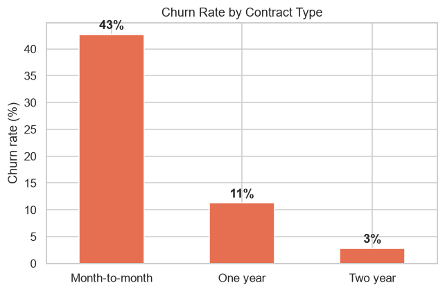
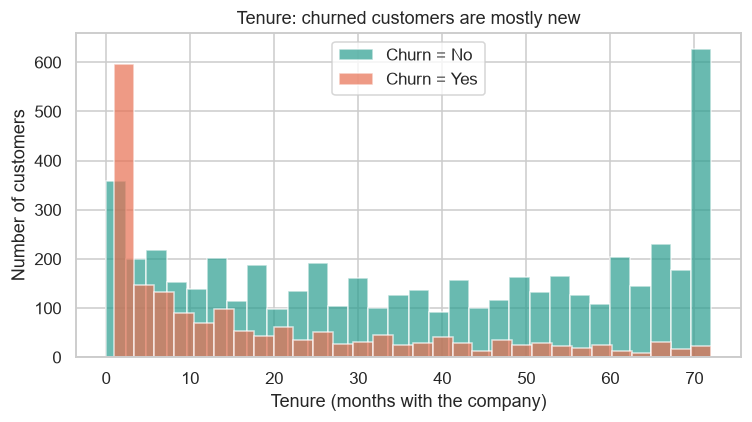
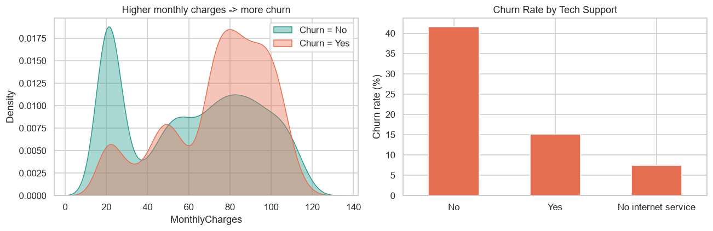
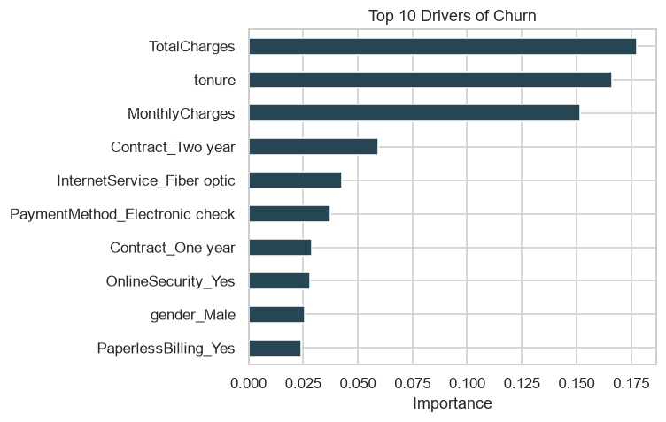

# 📉 Telecom Customer Churn: Analysis & Prediction

**Which customers are likely to leave, why do they leave, and what can the business do to keep them?**

For a telecom operator, every churned customer is lost recurring revenue — and retaining an existing customer is far cheaper than acquiring a new one. This project analyses **7,043 telecom customers** to uncover the drivers of churn, builds a model to predict at-risk customers, and translates the results into **actionable retention recommendations**.

> **Skills:** data analysis · data visualisation · machine learning · turning data into business decisions
> **Tools:** Python, pandas, scikit-learn, matplotlib, seaborn

---

## 📊 The data
The public **IBM Telco Customer Churn** dataset: 7,043 customers, each described by 20 attributes (contract type, tenure, monthly charges, services subscribed, etc.) and whether they churned.

**Overall churn rate: 26.5%** — roughly 1 in 4 customers left.

---

## 🔍 Key findings

### 1. Contract type is the single biggest driver
Month-to-month customers churn at **43%**, versus **11%** on one-year and just **3%** on two-year contracts.



### 2. New customers are the highest risk
Churned customers had an average tenure of **18 months**, compared to **38 months** for those who stayed — the first year is the danger zone.



### 3. Price and missing support matter
Customers with **higher monthly charges**, **no tech support/online security**, and **fiber-optic internet** churn noticeably more.



---

## 🤖 Predicting churn
Two standard models were trained on 80% of the data and tested on the unseen 20%:

| Model | Accuracy | ROC-AUC |
|-------|:--------:|:-------:|
| **Logistic Regression** | **81%** | **0.84** |
| Random Forest | 78% | 0.83 |

The logistic model reliably separates likely-leavers from likely-stayers (ROC-AUC of 0.84). The most influential churn drivers were **total & monthly charges, tenure, contract type, fiber-optic internet, and electronic-check payment**.



---

## 💡 Business recommendations
1. **Convert month-to-month customers** to 1- or 2-year contracts with targeted incentives — the biggest single lever on churn.
2. **Protect new customers** in their first months with onboarding and early-life offers, when risk is highest.
3. **Bundle tech support & online security**, especially for higher-paying and fiber customers.
4. **Focus retention budget** on the customers the model flags as high-risk, instead of spending on everyone.

*This is the same customer-value logic a telecom's retention / CVM (Customer Value Management) team uses in practice.*

---

## ▶️ How to run
```bash
pip install -r requirements.txt
jupyter notebook churn_analysis.ipynb
```
Or view [`churn_analysis.ipynb`](churn_analysis.ipynb) directly on GitHub — it renders with all charts and outputs.

## 📁 Repository structure
```
telecom-customer-churn/
├── churn_analysis.ipynb     # full analysis: data → charts → model → insights
├── data/                    # the Telco Customer Churn dataset
├── images/                  # charts generated by the notebook
├── requirements.txt
└── README.md
```

---
*Dataset: IBM Telco Customer Churn (public, for educational use).*
